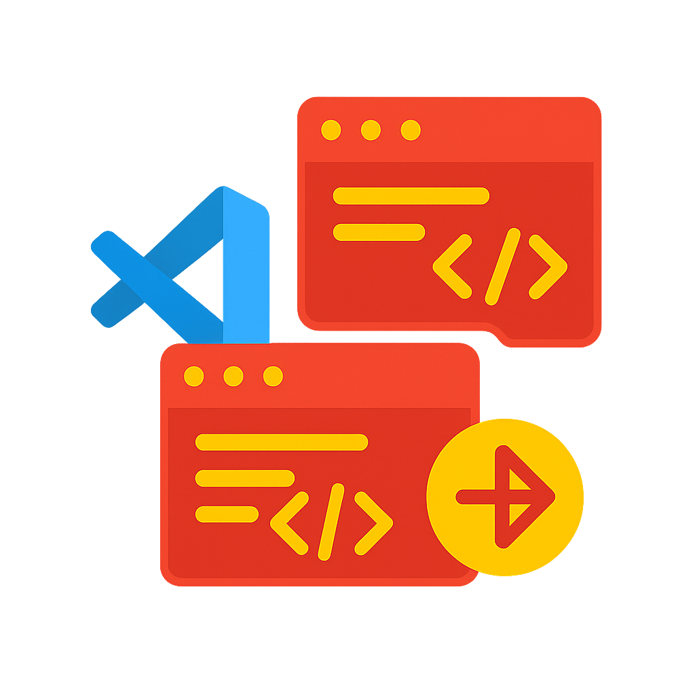

# J-Turn

A source control GUI extension for VSCode using JJ.

J-Turn is designed as a GUI-first interface for source control. Leveraging JJ's clean and powerful model, it provides visual metaphors like drag-and-drop actions for common source control operations such as rebase, merge, and moving files and hunks between commits.

This extension provides a basic structure for a VS Code extension, including:

- A "Hello World" command.
- A sidebar webview.
- A custom editor webview.

Use this as a starting point for your own VS Code extension development.

## Features

- **Hello World Command**: A simple command accessible from the command palette (`J-Turn: Hello World`).
- **Sidebar Webview**: A basic webview displayed in the activity bar.
- **Custom Editor Webview**: A webview that opens for files with the `.template` extension.

## Core Principles

- **Visual-first**: J-Turn prioritizes a graphical user interface to make source control intuitive and accessible, complementing JJ's powerful terminal interface.
- **Seamless VSCode Integration**: The extension is built to feel like a native part of the VS Code environment, providing a smooth and integrated user experience.
- **Performance and Reliability**: Operations are designed to be fast and dependable. The UI reflects the state of the repository, ensuring that actions are only available when their preconditions are met, preventing failures.

## Comparison with other tools

J-Turn differentiates itself from other VS Code extensions for source control, particularly those also built around JJ, such as Visual JJ and Jujitsu Kaizen.

- **Visual JJ:** Unlike Visual JJ, J-Turn is open source. Both focus on a visual editing experience, but Visual JJ is more opinionated about its push workflow, focusing on PRs.
- **Jujitsu Kaizen:** In contrast to Jujitsu Kaizen, J-Turn emphasizes a drag-and-drop and visual editing experience. Jujitsu Kaizen focuses more on aligning with the traditional Git command-line experience while using JJ under the hood.

J-Turn aims to provide a GUI-first, intuitive, and seamlessly integrated experience within VS Code, leveraging JJ's capabilities with a focus on visual metaphors for common source control operations.

## Getting Started

1. Clone this repository.
2. Open the repository in VS Code.
3. Press `F5` to run the extension in a new Extension Development Host window.

## Project Structure

- `src/extension.ts`: The main extension file where activation and contributions are registered.
- `src/sidebarWebview.ts`: Implements the `WebviewViewProvider` for the sidebar webview.
- `src/customEditor.ts`: Implements the `CustomEditorProvider` for the custom editor webview.
- `package.json`: The extension manifest.

## Building and Packaging

- Compile the TypeScript source code: `npm run compile`
- Watch for changes and compile automatically: `npm run watch`
- Run tests: `npm test`
- Package the extension: `vsce package`
- Publish the extension: `vsce publish`

## Release Notes

### 0.1.0

Initial release of the J-Turn extension.

- Basic "Hello World" command.
- Sidebar webview example.
- Custom editor webview example.
- Cleaned up from the original 'better-replace-on-save' extension.

---

**Enjoy!**
